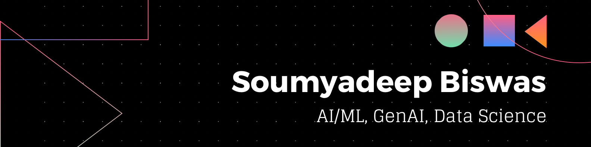

<h3 align="center">A Passionate Software Engineer from India</h3>

## 🌐 Socials:
 
 
 
 
 
 

## 💻 Tech Stack:
### AI/ML, Data Science

### AI/ML, Data Science

### Web

### Cloud

 ## 👨‍💻 Coding Profiles:
 
 
 
 
## 🚀 Open Source Contributions

| 🎁 Repo | ⭐ Stars | 📚 Forks | ✨ PR |
| --- | --- | --- | --- |
| [unifyai/ivy](https://github.com/unifyai/ivy) |  |  | [#26761](https://github.com/unifyai/ivy/pull/26761)   [#26394](https://github.com/unifyai/ivy/pull/26394)   [#25991](https://github.com/unifyai/ivy/pull/25991) |
| [duckduckgo/duckduckgo-privacy-extension](https://github.com/duckduckgo/duckduckgo-privacy-extension) |  |  | [#2171](https://github.com/duckduckgo/duckduckgo-privacy-extension/pull/2171) |
| [madhur/leetcode-format-chrome-extension](https://github.com/madhur/leetcode-format-chrome-extension) |  |  | [#18](https://github.com/madhur/leetcode-format-chrome-extension/pull/18) |

## 📊 GitHub Stats:
|||
|--|--|
|||
|  |  |
|  |  |

